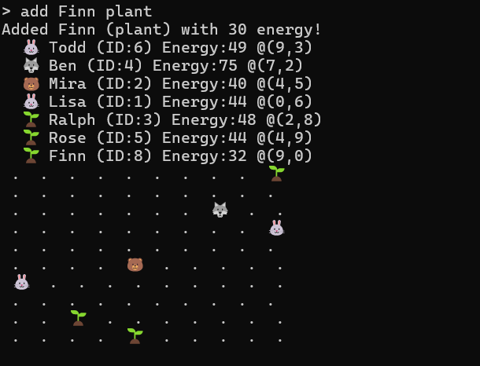
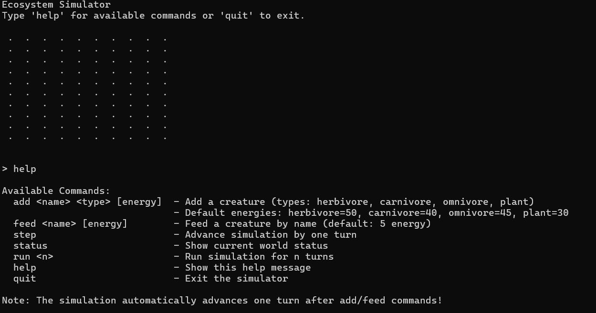

# Ecosystem Simulator

A CLI-based ecosystem simulation built in Gleam where creatures move, hunt, eat, and survive in a dynamic world.

---
**Note:** This is a personal hobby project to try out the Gleam programming language.
---



## Features

- **Interactive CLI Interface** - Add creatures, feed them, and watch the ecosystem evolve
- **Multiple Creature Types** - Herbivores, carnivores, omnivores, and plants with unique behaviors
- **Predator-Prey Dynamics** - Carnivores hunt herbivores with energy-based mechanics
- **Energy System** - Creatures consume energy to survive and can starve
- **Real-time Movement** - Animals move around the world automatically
- **Name-based Commands** - Interact with creatures by name

## How to Run

```sh
gleam run -m main
```

## Commands

- `add <name> <type> [energy]` - Add a creature (herbivore, carnivore, omnivore, plant)
- `feed <name> [energy]` - Feed a creature by name (default: 5 energy)
- `step` - Advance simulation by one turn
- `status` - Show current world status
- `run <n>` - Run simulation for n turns
- `help` - Show available commands
- `quit` - Exit the simulator

## Creature Types

- **🐰 Herbivores** - Eat plants, can be hunted
- **🐺 Carnivores** - Hunt herbivores, fight other carnivores
- **🐻 Omnivores** - Eat plants and can hunt, fight carnivores
- **🌱 Plants** - Grow energy over time, don't move

## Example Gameplay

```
> add Fluffy herbivore
Added Fluffy (herbivore) with 50 energy!

> add Rex carnivore  
Added Rex (carnivore) with 40 energy!

> feed Fluffy
Fed Fluffy with 5 energy!
```

The simulation automatically advances one turn after each command, so creatures move and interact dynamically!


